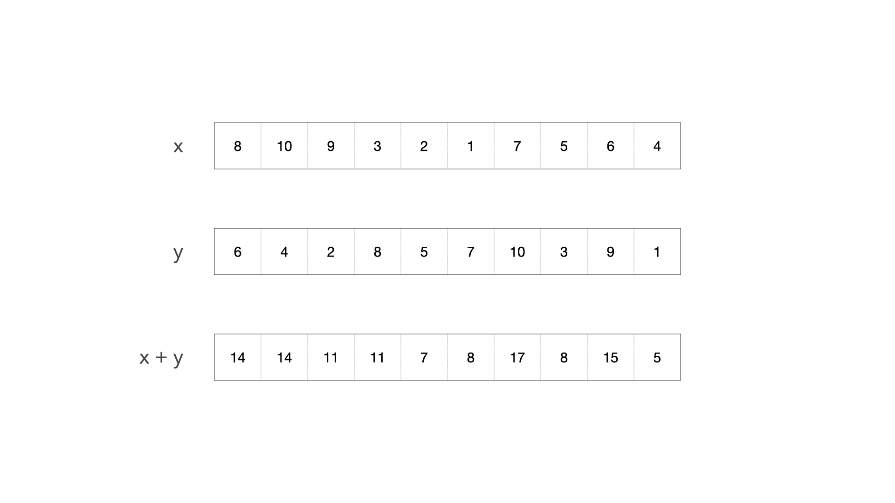

```{r setup, include=FALSE}
knitr::opts_chunk$set(echo=TRUE, comment=NULL)
```

## Principe général

Le calcul vectorisé (en anglais *Array programming*) permet de manière transparente de généraliser un certain nombre d'opérations (et de fonctions) à des séquences de valeurs en procédant terme à terme.

Ce comportement peut se retrouver dans certains langages (mais pas tous) : Matlab, Mathematica, etc.  Python ne pratique pas le calcul vectorisé mais la bibliothèque scientifique NumPy, elle, en tire un grand profit.

Ainsi, si $x$ est un vecteur de 10 valeurs numériques, on pourra calculer
`2 * x + 1` car R comprendra tout seul que l'opération $a \mapsto 2 \times a + 1$ doit être accomplie pour toutes les valeurs de $x$. Le résultat sera un vecteur de 10 valeurs contenant toutes les valeurs $2 \times x_i + 1$.

Cela se généralise avec des opérations impliquant non pas un vecteur et des valeurs scalaires mais aussi des opérations impliquant plusieurs vecteurs.  Ainsi l'expression `x + y` calculera-t-elle terme à terme les valeurs $x_i + y_i$ 
et `x + y/z` les valeurs $x_i + y_i/z_i$.



## Exemples

```{r, include=FALSE}
set.seed(123)
options(digits=3)
```

```{r}
x = sample(1:10)
y = sample(1:10)
(x - y)/(x + y)
```
