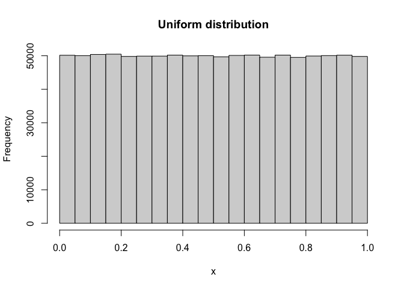
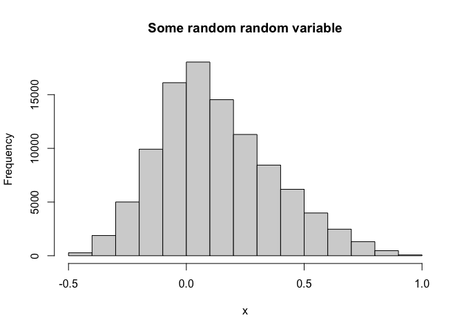

La fonction hist()
================

## Fonction générale

La fonction `hist()` représente l’histogramme des valeurs contenues dans
un vecteur *V* (1) soit générées par une variable aléatoire *continue*
ou (2) obtenues à partir d’un fichier de données.

    hist(V)

## Exemples

**EXEMPLE 1** Vérifier la distribution des valeurs d’une loi uniforme
entre \[0, 1\]:

``` r
R = 1000000
x = runif(R)
hist(x, main='Uniform distribution')
```

<!-- -->

**EXEMPLE 2** Quelle est la loi de probabilité continue

``` r
R = 100000
n = 3
x = replicate(R, {
    u = runif(n)
    min(u) - min(diff(sort(u)))
})
hist(x, main='Some random random variable')
```

<!-- -->

Quelle est la probabilité que la valeur de cette variable aléatoire soit
négative

``` r
sum(x <= 0)/R
```

    [1] 0.33195

## Utilisation avancée

On peut forcer la taille des intervalles `dx`

    hist(V, dx)

On peut donner un titre avec l’option `main`.
