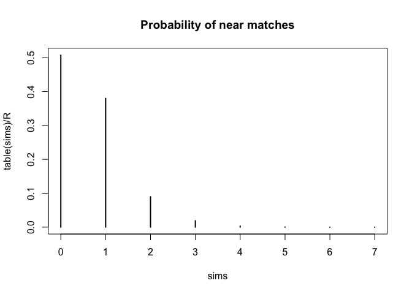

La fonction plot()
================

## Fonction générale

La fonction `plot()` produit un graphique des valeurs contenues dans les
données qui lui sont passées en argument.

Ces données peuvent prendre la forme de deux vecteurs *x* et *y* (ou de
façon équivalente, deux colonnes d’un
[cadre\_donnees](cadre%20de%20données)); le résultat est un nuage de
points (*scatter plot*)

    plot(x, y)
    plot(coly ~ colx, data=df)

Ces données peuvent prendre la forme d’un vecteur *t* essentiellement
issu de l’appel à [table](table)() (cf. les exemples); le résultat est
un graphique représentant une fonction de masse de probabilité.

    plot(t)

## Exemples

**EXEMPLE 1** Distance entre les deux anniversaires les plus proches
dans un groupe de *n* = 23 personnes:

``` r
R = 100000
n = 23
sims = replicate(R, {
    birthdays = sample(1:365, size=n, replace=TRUE)
    birthdays = sort(birthdays)
    min( diff(birthdays),
        (birthdays[1] + 365) - birthdays[n])
})

plot(table(sims)/R, main='Probability of near matches')
```

<!-- -->

**EXEMPLE 2** Représentation de 10 nombres aléatoires normaux triés par
ordre croissant

``` r
n = 10
x = sort(rnorm(n))

plot(1:n, x, main='Random numbers in increasing order')
```

<!-- -->
